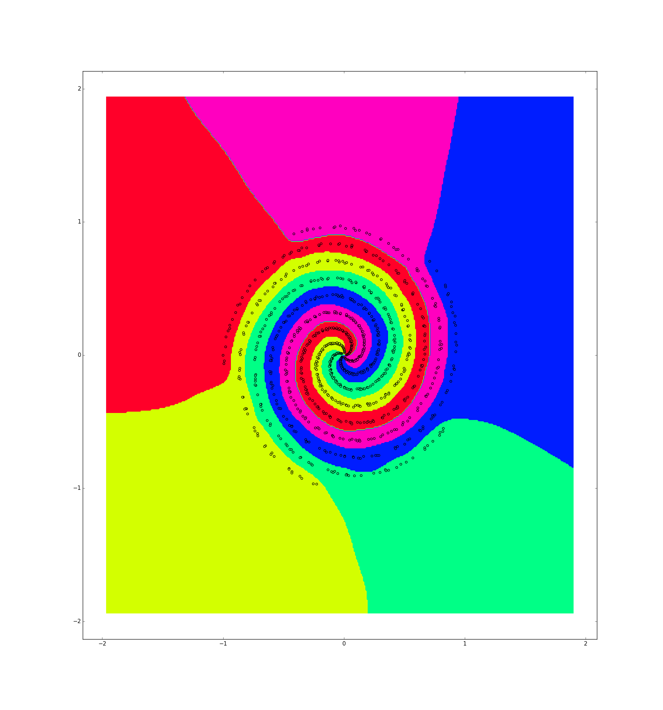

nn_toy
======
nn_toy is a small toy neural network created for educational purposes.
Currently, nn_toy supports the following layer types/operators: `fully
connected`, `relu`, `sigmoid`, `dropout`, `softmax`, `loss`, and `sum`.
It can be trained to classify points in R^2:

